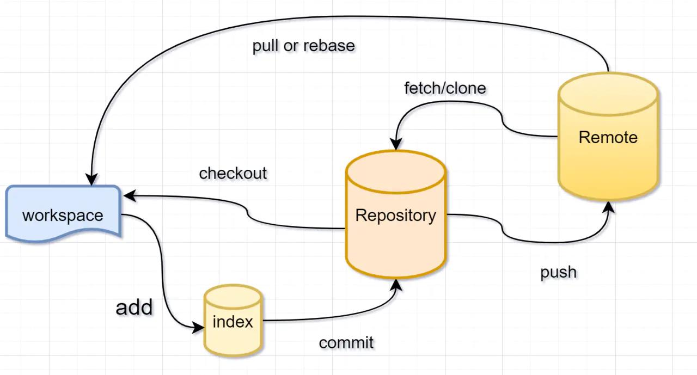
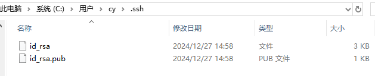
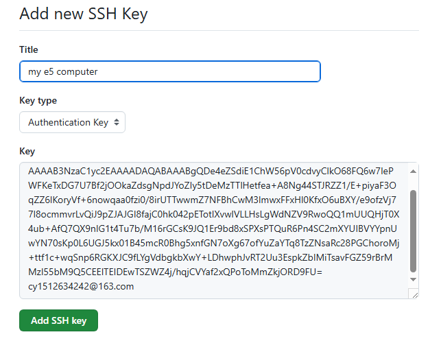

# git

菜鸟教程 [git教程](https://www.runoob.com/git/git-workflow.html)

## 1. SVN与git

- SVN：集中式版本控制系统
    版本库放在服务器上
- git：分布式版本控制系统
    版本库放在各自电脑上

## 2. 结构

## 3. 常用命令

### 3.1. 配置个人信息

git的每一个提交记录都需要记录姓名和邮箱

    git config --global user.name 'XXXX'
    git config --global user.email XXXXXXXXX@qq.com

### 3.2. 初始化

    git init

git 会在项目的根目录创建.git文件夹，保存git相关信息

### 3.3. 添加文件到暂存区

    # 添加a.c文件到暂存区
    git add a.c

    # 添加inc目录内所有文件到暂存区
    git add ./inc

### 3.4. 提交到仓库

    git commit -m "xxx"

    # 如执行
    git commit -m "first commit"

    # 输出
    [master (root-commit) ddae9a0] first commit
    1 file changed, 1 insertion(+)
    create mode 100644 test.txt
    # 其中master表示主分支，ddae9a0表示版本号

### 3.5. 查看文件修改内容

    git diff <file>

### 3.6. 查看commit记录

    git log

    #  简化log显示
    git log -pretty=oneline

### 3.7. 查看状态

    git status

### 3.8. 删除文件

- 文件没有在暂存区

    在工作区删除之后再commit

- 文件在暂存区

        # 从暂存区和工作区删除文件
        git rm <file>

### 3.9. 取消工作区的更改

    git checkout -- <file>

撤销修改，把文件在工作区做的修改（修改文件内容和删除文件操作）全部撤销

- 文件未在暂存区：回到版本库版本
- 文件在暂存区：回到添加到暂存区之前的状态

### 3.10. 取消暂存的更改

    # 取消暂存的修改并恢复到上一次commit的版本
    git restore --staged <file>

    # 取消某个文件暂存的修改
    git reset <file>

    # 取消所有文件暂存的修改
    git reset

### 3.11. 版本回退

#### 3.11.1. 回退到旧版本

    # 退回到上个版本
    git reset --hard HEAD^
   
    # 退回到上上个版本
    git reset --hard HEAD^^

    # 退回到前100个版本
    git reset --hard HEAD~100
    

**注意**：git log 只会显示回退版本及之前的记录

#### 3.11.2. 回退到新版本

    # 显示退回记录及commit记录
    git relog

    # 回退到新版本
    git reset --hard [版本号]

### 3.12. 远程仓库

#### 3.12.1. 创建ssh key

    ssh-keygen -t sra -C "youremmail@example.com"

- id_rsa：私钥
- id_rsa_pub：公钥

复制 id_rsa_pub 中的内容到github中

#### 3.12.2. 添加远程仓库

    git remote add origin https://github.com/xxx/xxx.git

#### 3.12.3. 删除远程分支

    git push origin --delete master

#### 3.12.4. 推送到远程仓库

    # 推送到远程master分支
    git push origin master

    # 推送到远程develop分支
    git push origin develop

    # 本地版本与远程版本有差异，需要强制推送时
    git push --force origin master

#### 3.12.5. 拉取合并远程仓库分支

    # 拉取远程
    git fetch origin

    # 合并master分支
    git merge origin/master

    # 拉取并合并master分支，=fetch+merge
    git pull origin master

#### 3.12.6. 克隆远程仓库

    git clone https://github.com/xxx/xxx.git

#### 3.12.7. 查看远程仓库

    git remote

    # 查看详细信息
    git remote -v

### 3.13. 分支与合并

#### 3.13.1. 创建和切换分支

    # 创建名为dev的分支，并切换
    git checkout -b dev

    # 查看当前分支
    git branch

    # 创建名为dev的分支
    git branch dev

    # 切换到dev分支
    git checkout dev

#### 3.13.2. 分支合并

    # 1.切换到master分支
    git checkout master

    # 2.把dev分支的内容合并到master
    git merge dev

#### 3.13.3. 合并冲突

当合并过程中出现冲突时，Git 会标记冲突文件，你需要手动解决冲突。

    # 1.添加解决完毕的冲突文件到暂存区
    git add <conflict-file>

    # 2.提交合并结果
    git commit

打开冲突文件，按照标记解决冲突。

#### 3.13.4. 删除分支

    # 1.切换到master分支
    git checkout master

    # 2.删除dev分支
    git branch -d dev

#### 3.13.5. 分支管理策略

git一般使用”Fast forward”模式，在这种模式下，删除分支后，会丢掉分支信息。

    # 禁用Fast forward模式
    git merge –no-ff dev

