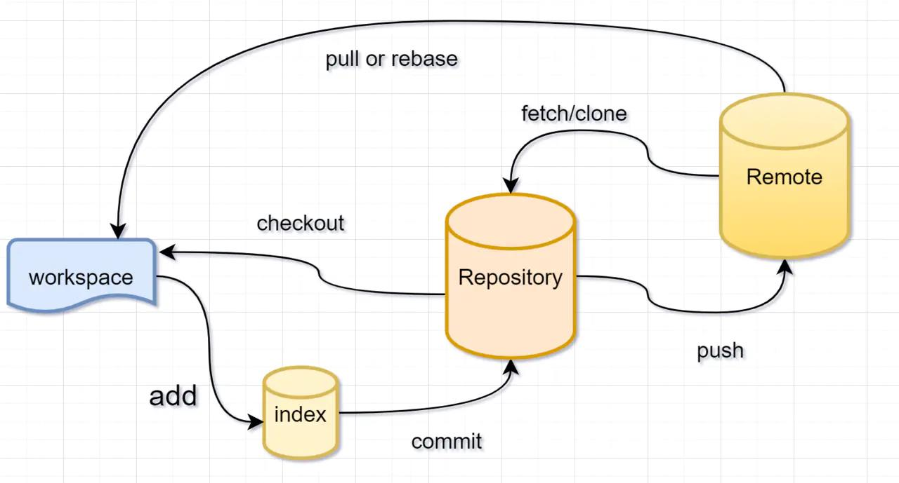

# git

## 1. SVN与git

- SVN：集中式版本控制系统
    版本库放在服务器上
- git：分布式版本控制系统
    版本库放在各自电脑上

## 2. 结构

## 3. 常用命令

### 3.1. git init

初始化git管理仓库

### 3.2. git add [file]

添加文件到暂存区

### 3.3. git diff [file]

查看文件修改内容

### 3.4. git log

查看commit记录

- git log -pretty=oneline
    简化log显示

### 3.5. git status

查看状态

### 3.6. 删除文件

在工作区删除之后再commit

### 3.7. 版本回退

#### 3.7.1. 回退到旧版本

- git reset --hard HEAD^
    退回到上个版本
- git reset --hard HEAD^^
    退回到上上个版本
- git reset --hard HEAD~100
    退回到前100个版本

**注意**：git log 只会显示回退版本及之前的记录

#### 3.7.2. 回退到新版本

- git relog
    显示退回记录及commit记录

- git reset --hard [版本号]

### 3.8. git checkout --[file]

撤销修改，把文件在工作区做的修改（修改文件内容和删除文件操作）全部撤销

- 文件未在暂存区：回到版本库版本
- 文件在暂存区：回到添加到暂存区之前的状态

### 3.9. 远程仓库
